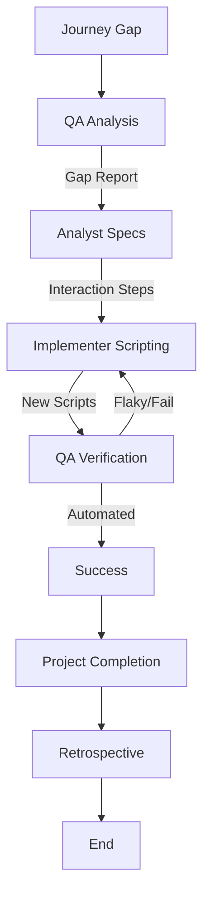

# Test Coverage Expansion Workflow

This workflow systematically increases test coverage for legacy or critical code paths.

## Workflow Overview

Coverage is not just a number; it's confidence. This workflow targets "dark corners" of the USER EXPERIENCE and illuminates them with interaction tests (Playwright/Simulator).

## Workflow Steps

### 1. Journey Gap Analysis (QA Agent)
- **Agent**: QA
- **Input**: Product Brief, Existing Playwright/Simulator Specs.
- **Execution**: Use the `runSubagent` tool to run the **QA** agent.
    - **Task**: "Identify critical USER JOURNEYS that are not currently automated. Output Journey Gap Report."
- **Output**: Journey Gap Report in `agent-output/qa/`.
- **Handoff**: Passed to Analyst.

### 2. Journey Specification (Analyst Agent)
- **Agent**: Analyst
- **Input**: Journey Gap Report.
- **Execution**: Use the `runSubagent` tool to run the **Analyst** agent.
    - **Task**: "Define the exact steps (Click X, Type Y, See Z) for the missing journeys. Output Interaction Spec."
- **Output**: Interaction Spec in `agent-output/analysis/`.
- **Handoff**: Passed to Critic.

### 2b. Spec Detail Verification (Critic Agent)
- **Agent**: Critic
- **Input**: Test Case Specification.
- **Action**: **CRITICAL**: Use the `runSubagent` tool to run the Critic agent to review specifically for "lack of detail". Ensure test cases are fully defined (Input + Expected Output).
- **Iteration**: Return to **Analyst** if vague.
- **Handoff**: Passed to Implementer.

### 3. Automation Implementation (Implementer/QA Agent)
- **Agent**: Implementer
- **Input**: Interaction Spec.
- **Execution**: Use the `runSubagent` tool to run the **Implementer** agent.
    - **Task**: "Write Playwright/Puppeteer/Simulator scripts. Do NOT modify production code. Output New automation scripts."
- **Output**: New automation scripts.
- **Handoff**: Passed to QA.

- **Handoff**: Passed to Critic.

### 3b. Code Review & Refinement (Critic Agent)
- **Agent**: Critic
- **Input**: New Tests.
- **Action**: Use the `runSubagent` tool to run the Critic agent to ensure scripts are robust and not brittle.
- **Checks**:
  - Uses resilient selectors (test-ids, roles).
  - No hardcoded sleeps.
- **Iteration**: Any findings must be addressed by **Implementer** before Verification.
- **Handoff**: Passed to QA.

### 4. Verification (QA Agent)
- **Agent**: QA
- **Input**: New tests.
- **Execution**: Use the `runSubagent` tool to run the **QA** agent.
    - **Task**: "Run tests and check coverage metrics. Verify targets met."
- **Iteration Loop**:
  - **FAIL**: Script implies the feature is broken OR script is flaky. Implementer fixes script.
  - **PASS**: User Journey is now automated.

### 5. Project Completion (Orchestrator)
- **Agent**: Orchestrator
- **Action**: Archive artifacts and generate final report.
- **Output**:
  - Move terminal artifacts to `agent-output/closed/`
  - Generate **Single** Project Completion Report: `agent-output/completion/[ID]-completion-report.md`
  - Generate **Single** Project Completion Report: `agent-output/completion/[ID]-completion-report.md`
  - Proceed to Phase 6.

### 6. Retrospective (Retrospective)
- **Agent**: Retrospective
- **Input**: All `agent-output/` artifacts.
- **Execution**: Use the `runSubagent` tool to run the **Retrospective** agent.
    - **Task**: "Read `custom-agents/instructions/output_standards.md`. Run Retrospective analysis. Output `agent-output/retrospectives/retrospective-[ID].md`."
- **Output**: `agent-output/retrospectives/retrospective-[ID].md`
- **STOP** (End of Workflow)

## Agent Roles Summary

| Agent | Role | Output Location |
| :--- | :--- | :--- |
| **QA** | Identify Gaps | `agent-output/qa/` |
| **Analyst** | Spec Behavior | `agent-output/analysis/` |
| **Implementer** | Write Tests | Test Files |
| **Orchestrator** | Final Report | `agent-output/completion/` |

## Workflow Diagram

