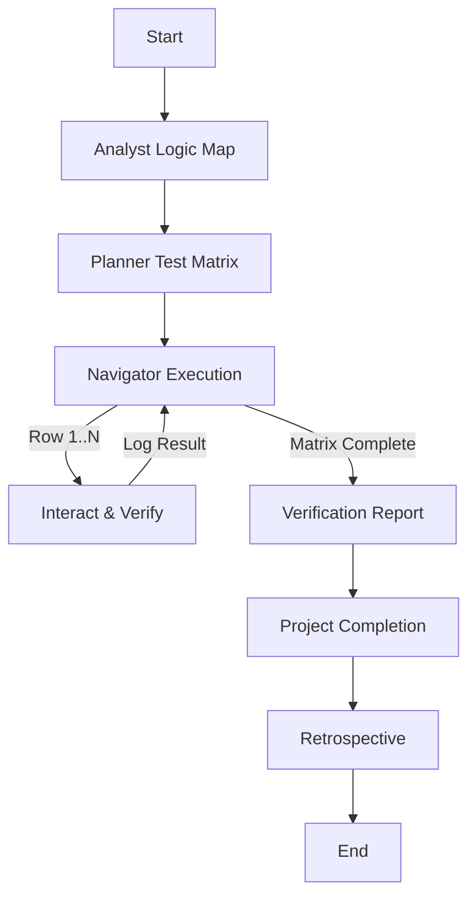

# Experience Builder Widget Testing Workflow

This workflow is specialized for testing ArcGIS Experience Builder custom widgets. It focuses on deep interactivity, combinatorial testing of form inputs, and robust verification of widget functionality within a contained context.

## Workflow Overview

Widgets are high-density interaction zones. Unlike full app navigation, this workflow emphasizes **state permutations**.
Cycle: **Analysis (What is this?) -> Design (Combinatorial Matrix) -> Execution (Playwright Interactions) -> Verification**.

## Workflow Steps

### 1. Widget Analysis (Analyst Agent)
- **Agent**: Analyst
- **Input**: Widget Source Code (`tsx`, `config.json`, `setting.tsx`).
- **Execution**: Use the `runSubagent` tool to run the **Analyst** agent.
    - **Task**: "Deep dive into widget logic. Identify Inputs, Outputs, and States. Output Widget Logic Map."
- **Output**: Widget Logic Map in `agent-output/analysis/`.
- **Handoff**: Passed to Planner.

### 2. Test Matrix Design (Planner Agent)
- **Agent**: Planner
- **Input**: Widget Logic Map.
- **Execution**: Use the `runSubagent` tool to run the **Planner** agent.
    - **Task**: "Design Robust Verification Matrix covering all combinations. Output Test Matrix."
- **Requirement**: Cover "All Combinations" of critical variables.
  - Example: `[Toggle A: On/Off] x [Dropdown B: Option 1/2] x [Map Selection: Yes/No]`
- **Output**: Combinatorial Test Matrix (Markdown / JSON table).
- **Handoff**: Passed to Critic.

### 2b. Matrix Detail Verification (Critic Agent)
- **Agent**: Critic
- **Input**: Combinatorial Test Matrix.
- **Action**: **CRITICAL**: Use the `runSubagent` tool to run the Critic agent to review specifically for "lack of detail". Ensure all combinations are explicitly listed or algorithmically defined.
- **Iteration**: Return to **Planner** if vague.
- **Handoff**: Passed to Navigator.

### 3. Interactive Verification (Navigator Agent)
- **Agent**: Navigator
- **Input**: Combinatorial Test Matrix.
- **Execution**: Use the `runSubagent` tool to run the **Navigator** agent.
    - **Task**: "Execute the matrix using `playwright` or `ios-simulator`. For each row: Configure, Interact, Verify, Reset. Output Verification Logs and Screenshots."
- **Output**:
  - `verification-logs.md`: Pass/Fail per matrix row.
  - Screenshots of each state.
- **Handoff**: Passed to Orchestrator.

### 4. Project Completion (Orchestrator)
- **Agent**: Orchestrator
- **Action**: Archive artifacts and generate final report.
- **Output**:
  - Move terminal artifacts to `agent-output/closed/`
  - Generate **Single** Project Completion Report: `agent-output/completion/[ID]-completion-report.md`
  - Generate **Single** Project Completion Report: `agent-output/completion/[ID]-completion-report.md`
  - Proceed to Phase 5.

### 5. Retrospective (Retrospective)
- **Agent**: Retrospective
- **Input**: All `agent-output/` artifacts.
- **Execution**: Use the `runSubagent` tool to run the **Retrospective** agent.
    - **Task**: "Read `custom-agents/instructions/output_standards.md`. Run Retrospective analysis. Output `agent-output/retrospectives/retrospective-[ID].md`."
- **Output**: `agent-output/retrospectives/retrospective-[ID].md`
- **STOP** (End of Workflow)

## Agent Roles Summary

| Agent | Role | Output Location |
| :--- | :--- | :--- |
| **Analyst** | Logic Mapping | `agent-output/analysis/` |
| **Planner** | Matrix Design | `agent-output/planning/` |
| **Navigator** | Matrix Execution | `agent-output/navigation/` |
| **Orchestrator** | Final Report | `agent-output/completion/` |

## Workflow Diagram

