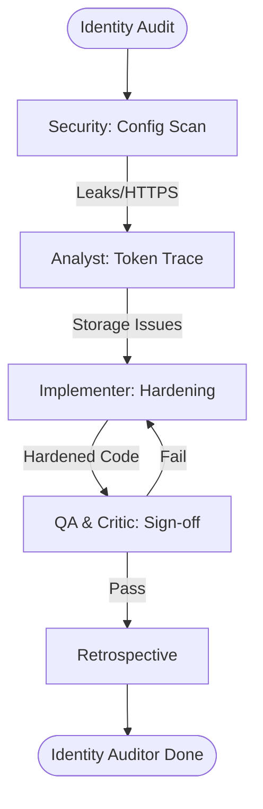

# ArcGIS Identity Auditor Workflow

This workflow performs a specialized security audit of your ArcGIS authentication implementation and token management lifecycle.

## Workflow Overview

Identity is the primary entryway to your spatial data. This workflow enforces **Configuration Audit -> Storage Path Analysis -> Scope Verification -> Remediation Planning**.

## Workflow Steps

### 1. Configuration & URL Audit (Security)
- **Agent**: Security
- **Goal**: Detect hardcoded URLs/Secrets and identify insecure endpoint protocols.
- **Execution**: Use `runSubagent` tool to run the **Security** agent.
    - **Task**: "Scan project files for Client Secrets and clear-text API keys. Verify that all Portal/Server URLs use HTTPS. Audit `redirect_uri` for app-link security. Output to `agent-output/security/identity-audit-report.md`."
- **Output**: `agent-output/security/identity-audit-report.md`
- **Handoff**: To Analyst.

### 2. Token Lifecycle Analysis (ArcGIS Specialist)
- **Agent**: ArcGIS Specialist
- **Goal**: Analyze how tokens are stored and refreshed on each platform.
- **Execution**: Use `runSubagent` tool to run the **ArcGIS Specialist** agent.
    - **Task**: "Read `identity-audit-report.md`. Trace token storage (LocalStorage vs KeyChain/EncryptedSharedPreferences). Analyze refresh token duration and silent-renewal logic. Output `agent-output/analysis/token-security-map.md`."
- **Output**: `agent-output/analysis/token-security-map.md`
- **Handoff**: To Implementer.

### 3. Implementation Hardening (Implementer)
- **Agent**: Implementer
- **Goal**: Apply secure storage patterns and fix configuration leaks.
- **Execution**: Use `runSubagent` tool to run the **Implementer** agent.
    - **Task**: "Migrate token storage to target platform's Secure Storage (Flutter `secure_storage`, MAUI `SecureStorage`). Move secrets to env-specific build configs. Output code changes."
- **Output**: Code changes for Identity services.
- **Handoff**: To QA.

### 4. Handshake & Scope Verification (QA & Critic)
- **Agent**: QA, Critic
- **Goal**: Ensure the hardened implementation still functions and follows least privilege.
- **Actions**:
    1.  **QA**: Perform login/refresh cycles in a simulator/browser.
    2.  **Critic**: Verify that requested OAuth2 Scopes are minimal (no unnecessary `admin` rights).
- **Output**: `agent-output/reports/identity-sign-off.md`

### 5. Retrospective (Retrospective)
- **Agent**: Retrospective
- **Input**: All `agent-output/` artifacts.
- **Execution**: Use the `runSubagent` tool to run the **Retrospective** agent.
    - **Task**: "Read `custom-agents/instructions/output_standards.md`. Run Retrospective analysis. Output `agent-output/retrospectives/retrospective-[ID].md`."
- **Output**: `agent-output/retrospectives/retrospective-[ID].md`

## Agent Roles Summary

| Agent | Role | Output Location |
| :--- | :--- | :--- |
| **Security** | Config Audit | `agent-output/security/` |
| ArcGIS Specialist | Lifecycle Trace | `agent-output/analysis/` |
| **Implementer** | Hardening Fixes | Codebase |
| **QA** | Functional Test | `agent-output/reports/` |
| **Critic** | Scope/Policy Review| `agent-output/reports/` |

## Workflow Diagram

## Governance
- **Standards**: Must adhere to `custom-agents/instructions/output_standards.md`.
- **Policy**: No credentials should ever be logged to `STDOUT` or file systems in plain text.
