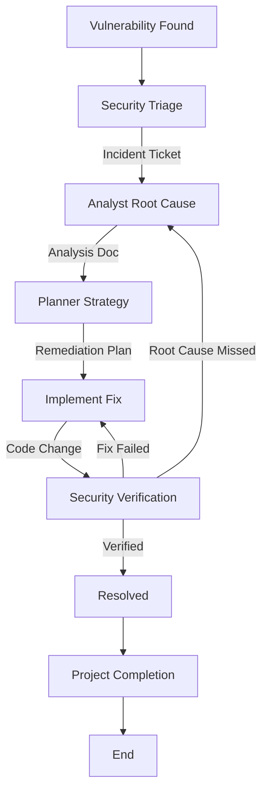

# Security Remediation Workflow

This workflow defines the standard process for addressing security vulnerabilities. It emphasizes root cause analysis and comprehensive verification.

## Workflow Overview

Security fixes must be precise. This workflow ensures we don't just "patch" the symptom but understand and fix the root cause, verifying it with the same rigor used to find it.

## Workflow Steps

### 1. Triage & Assessment (Security Agent)
- **Agent**: Security
- **Input**: Vulnerability report (from tool or external source).
- **Execution**: Use the `runSubagent` tool to run the **Security** agent.
    - **Task**: "Read `custom-agents/instructions/output_standards.md`. Assess vulnerability severity and impact. Output Security Incident Ticket."
- **Output**: Security Incident Ticket in `agent-output/security/incident-ticket.md`.
- **Handoff**: `agent-output/handoffs/sec-fix-phase-1-handoff.md` (Template: Data-Only, No Fluff)

### 2. Root Cause Analysis (Analyst Agent)
- **Agent**: Analyst
- **Input**: `agent-output/handoffs/sec-fix-phase-1-handoff.md` AND `agent-output/security/incident-ticket.md`
- **Execution**: Use the `runSubagent` tool to run the **Analyst** agent.
    - **Task**: "Read `custom-agents/instructions/output_standards.md`. Locate vulnerability in code. Trace from Sink to Source. Output Root Cause/Data Flow Analysis."
- **Handoff**: `agent-output/handoffs/sec-fix-phase-2-handoff.md` (Template: Data-Only, No Fluff)

### 3. Remediation Planning (Planner Agent)
- **Agent**: Planner
- **Input**: `agent-output/handoffs/sec-fix-phase-2-handoff.md` AND `agent-output/analysis/root-cause.md`
- **Execution**: Use the `runSubagent` tool to run the **Planner** agent.
    - **Task**: "Read `custom-agents/instructions/output_standards.md`. Plan the fix (patch/upgrade/rewrite) considering side effects. Output Remediation Plan."
- **Considerations**: patches, library upgrades, or code rewrites. Must consider side effects.
- **Output**: `agent-output/planning/remediation-plan.md`.
- **Handoff**: `agent-output/handoffs/sec-fix-phase-3-handoff.md` (Template: Data-Only, No Fluff)

### 3a. Plan Critique (Critic Agent)
- **Agent**: Critic
- **Input**: Remediation Plan.
- **Action**: Use the `runSubagent` tool to run the Critic agent to verify the plan addresses the root cause without introducing new vulnerabilities.
- **Iteration**: Return to **Planner** if insufficient.

### 3b. Documentation Detail Verification (Critic Agent)
- **Agent**: Critic
- **Input**: `agent-output/planning/remediation-plan.md`
- **Action**: **CRITICAL**: Use the `runSubagent` tool to run the Critic agent to review specifically for "lack of detail". Security fixes cannot be ambiguous.
- **Iteration Link**: Return to **Planner** if vague.
- **Handoff**: To Implementer.

### 4. Application of Fix (Implementer Agent)
- **Agent**: Implementer
- **Input**: `agent-output/handoffs/sec-fix-phase-3-handoff.md` AND `agent-output/planning/remediation-plan.md`
- **Execution**: Use the `runSubagent` tool to run the **Implementer** agent.
    - **Task**: "Read `custom-agents/instructions/output_standards.md`. Apply the fix. Output Code changes."
- **Output**: Code changes + `agent-output/implementation/remediation-impl.md`.
- **Handoff**: `agent-output/handoffs/sec-fix-phase-4-handoff.md` (Template: Data-Only, No Fluff)

### 4b. Code Review & Refinement (Critic Agent)
- **Agent**: Critic
- **Input**: Security Fix Code.
- **Action**: Use the `runSubagent` tool to run the Critic agent to ensure the fix is secure and follows standards.
- **Checks**:
  - Secure Coding Patterns.
  - Maintainability.
- **Iteration**: Any findings must be addressed by **Implementer** before Verification.
- **Handoff**: To Security.

### 5. Verification (Security Agent)
- **Agent**: Security
- **Input**: `agent-output/handoffs/sec-fix-phase-4-handoff.md` AND `agent-output/implementation/remediation-impl.md`
- **Execution**: Use the `runSubagent` tool to run the **Security** agent.
    - **Task**: "Read `custom-agents/instructions/output_standards.md`. Verify fix specifically addresses vulnerability. Use `view_file` and security scanners."
- **Iteration Loop**:
  - **FAIL**: Fix is ineffective or incomplete. Return to **Analyst** (if root cause wrong) or **Implementer** (if implementation flawed).
  - **PASS**: Issue Resolved. Create `agent-output/handoffs/sec-fix-phase-5-handoff.md` (Template: Data-Only, No Fluff).

### 6. Project Completion (Orchestrator)
- **Agent**: Orchestrator
- **Action**: Archive artifacts and generate final report.
- **Output**:
  - Move terminal artifacts to `agent-output/closed/`
  - Generate **Single** Project Completion Report: `agent-output/reports/[ID]-completion-report.md`
  - **STOP** (End of Workflow)

## Agent Roles Summary

| Agent | Role | Output Location |
| :--- | :--- | :--- |
| **Security** | Triage & Verify | `agent-output/security/` |
| **Analyst** | Root Cause | `agent-output/analysis/` |
| **Planner** | Plan Fix | `agent-output/planning/` |
| **Implementer** | Apply Fix | Codebase |
| **Orchestrator** | Final Report | `agent-output/reports/` |

## Workflow Diagram

