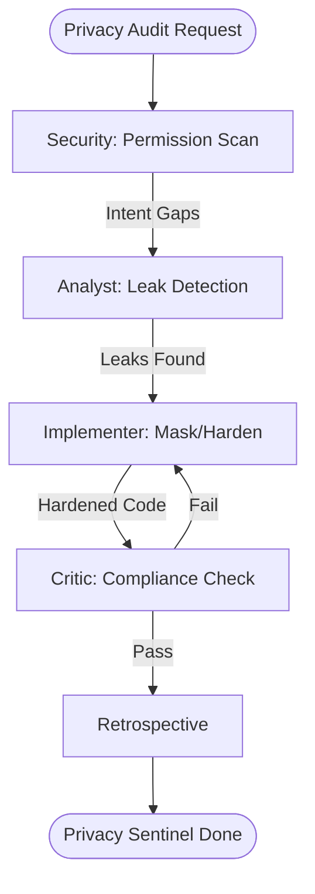

# Spatial Data Privacy Sentinel Workflow

This workflow protects user privacy by auditing the handling of location data and ensuring compliance with platform-specific privacy policies.

## Workflow Overview

Location leaks are a major liability. This workflow enforces **Permission Audit -> Traffic Leak Analysis -> Geometric Masking -> Mandatory Privacy Review**.

## Workflow Steps

### 1. Permission & Intent Audit (Security)
- **Agent**: Security
- **Goal**: Ensure location permission requests are justified and minimal.
- **Execution**: Use `runSubagent` tool to run the **Security** agent.
    - **Task**: "Audit `AndroidManifest.xml`, `Info.plist`, and React manifests. Verify 'Reasoning Strings' are clear. check for unnecessary `Always` vs `WhenInUse` permissions. Output `agent-output/security/privacy-intent-audit.md`."
- **Output**: `agent-output/security/privacy-intent-audit.md`
- **Handoff**: To Analyst.

### 2. Network Traffic & Leak Analysis (ArcGIS Specialist)
- **Agent**: ArcGIS Specialist
- **Goal**: Detect if location data is sent to non-spatial authorized domains.
- **Execution**: Use `runSubagent` tool to run the **ArcGIS Specialist** agent.
    - **Task**: "Scan codebase for network calls using coordinate parameters. Cross-reference against an 'Authorized Domain List' (e.g. ArcGIS). Flag any third-party SDKs receiving precise data. Output `agent-output/analysis/location-leak-report.md`."
- **Output**: `agent-output/analysis/location-leak-report.md`
- **Handoff**: To Implementer.

### 3. Privacy Masking Implementation (Implementer)
- **Agent**: Implementer
- **Goal**: Implement coordinate "fuzzing" or masking for non-critical services.
- **Execution**: Use `runSubagent` tool to run the **Implementer** agent.
    - **Task**: "Apply coordinate generalization (e.g. truncation or jitter) for non-GIS services identified in the leak report. Ensure precise data is only used for authorized spatial operations. Output code changes."
- **Output**: Privacy-hardened source code.
- **Handoff**: To Critic.

### 4. Final Compliance & Privacy Sign-off (Critic)
- **Agent**: Critic
- **Goal**: Final validation of privacy-first location handling.
- **Actions**:
    1.  **Critic**: Validate that the app's internal privacy manifest matches actual behavior.
    2.  **Verify**: Ensure no "Background Location" activity occurs without explicit user consent.
- **Output**: `agent-output/reports/privacy-sentinel-sign-off.md`

### 5. Retrospective (Retrospective)
- **Agent**: Retrospective
- **Input**: All `agent-output/` artifacts.
- **Execution**: Use the `runSubagent` tool to run the **Retrospective** agent.
    - **Task**: "Read `custom-agents/instructions/output_standards.md`. Run Retrospective analysis. Output `agent-output/retrospectives/retrospective-[ID].md`."
- **Output**: `agent-output/retrospectives/retrospective-[ID].md`

## Agent Roles Summary

| Agent | Role | Output Location |
| :--- | :--- | :--- |
| **Security** | Permission Audit | `agent-output/security/` |
| ArcGIS Specialist | Leak Detection | `agent-output/analysis/` |
| **Implementer** | Masking Fixes | Codebase |
| **Critic** | Policy Compliance | `agent-output/reports/` |

## Workflow Diagram

## Governance
- **Standards**: Must adhere to `custom-agents/instructions/output_standards.md`.
- **Constraint**: Masking must not break critical app functionality like navigation or asset tracking.
