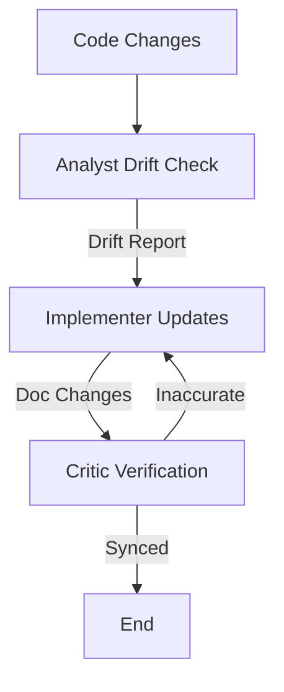

# Documentation Sync Workflow

This workflow ensures that documentation (READMEs, API docs, inline comments) stays synchronized with the actual code.

## Workflow Overview

Drift between code and documentation is a major source of confusion. This workflow treats documentation updates as a first-class citizen, requiring verification just like code.

## Workflow Steps

### 1. Drift Detection (Analyst Agent)
- **Agent**: Analyst
- **Input**: Codebase and existing documentation.
- **Action**: Compare exported symbols, API signatures, and CLI arguments against the docs.
- **Mandatory MCP Usage**:
  - Use `grep_search` to find exported functions.
  - Use `view_file` to read existing docs.
- **Output**: Drift Report in `agent-output/analysis/` listing specific discrepancies.
- **Handoff**: Passed to Implementer.

### 2. Documentation Update (Implementer Agent)
- **Agent**: Implementer
- **Input**: Drift Report.
- **Action**: Draft updated documentation.
- **Output**: Changes to `.md` files or inline comments.
- **Handoff**: Passed to Critic/QA.

### 3. Accuracy Verification (Critic Agent)
- **Agent**: Critic (or QA)
- **Input**: Documentation Diff, Drift Report.
- **Action**: Verify that the new text accurately describes the code behavior.
- **Checks**:
  - No "hallucinated" parameters.
  - Examples actually run/compile.
  - Links are valid.
- **Iteration Loop**:
  - **FAIL**: Inaccurate or unclear. Return to **Implementer**.
  - **PASS**: Docs are synced.

## Agent Roles Summary

| Agent | Role | Output Location |
| :--- | :--- | :--- |
| **Analyst** | Detect Drift | `agent-output/analysis/` |
| **Implementer** | Write Docs | Documentation Files |
| **Critic** | Verify Accuracy | `agent-output/critiques/` |

## Workflow Diagram

