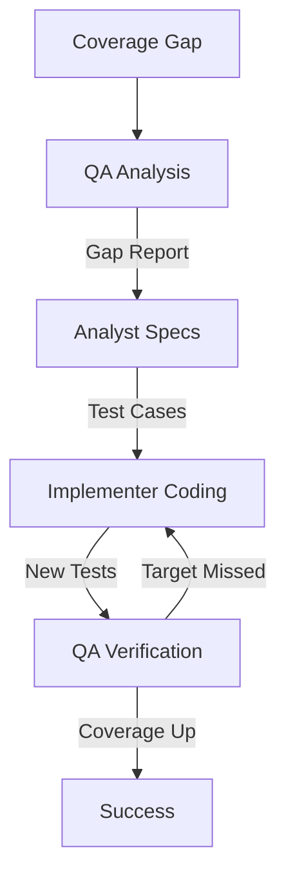

# Test Coverage Expansion Workflow

This workflow systematically increases test coverage for legacy or critical code paths.

## Workflow Overview

Coverage is not just a number; it's confidence. This workflow targets "dark corners" of the codebase and illuminates them with tests, without modifying the logic itself.

## Workflow Steps

### 1. Gap Analysis (QA Agent)
- **Agent**: QA
- **Input**: Coverage reports (LCOV, JaCoCo, etc.) or manual analysis.
- **Action**: Identify critical paths with low or no coverage. Prioritize based on business risk.
- **Output**: Coverage Gap Report in `agent-output/qa/`.
- **Handoff**: Passed to Analyst.

### 2. Logic Analysis (Analyst Agent)
- **Agent**: Analyst
- **Input**: Coverage Gap Report.
- **Action**: deep-dive into the uncovered code to understand *what* it does and *how* to invoke it.
- **Mandatory MCP Usage**:
  - Use `view_file` to read the code.
  - Use `grep_search` to find existing calls (if any).
- **Output**: Test Case Specification in `agent-output/analysis/` (inputs -> expected outputs).
- **Handoff**: Passed to Implementer.

### 3. Test Implementation (Implementer Agent)
- **Agent**: Implementer
- **Input**: Test Case Specification.
- **Action**: Write unit or integration tests.
- **Constraint**: **Do NOT modify production code** (unless strictly necessary for testability, e.g., dependency injection).
- **Output**: New test files.
- **Handoff**: Passed to QA.

### 4. Verification (QA Agent)
- **Agent**: QA
- **Input**: New tests.
- **Action**: Run tests and check coverage metrics.
- **Mandatory MCP Usage**:
  - Use `run_command` to execute tests with coverage.
  - Use `playwright` or `ios-simulator` if implementing UI/E2E tests.
- **Iteration Loop**:
  - **FAIL**: Coverage target missed or tests fail. Return to **Implementer**.
  - **PASS**: Coverage improved.

## Agent Roles Summary

| Agent | Role | Output Location |
| :--- | :--- | :--- |
| **QA** | Identify Gaps | `agent-output/qa/` |
| **Analyst** | Spec Behavior | `agent-output/analysis/` |
| **Implementer** | Write Tests | Test Files |

## Workflow Diagram

